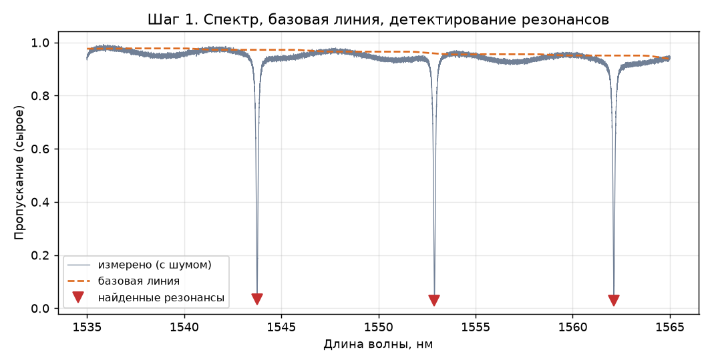
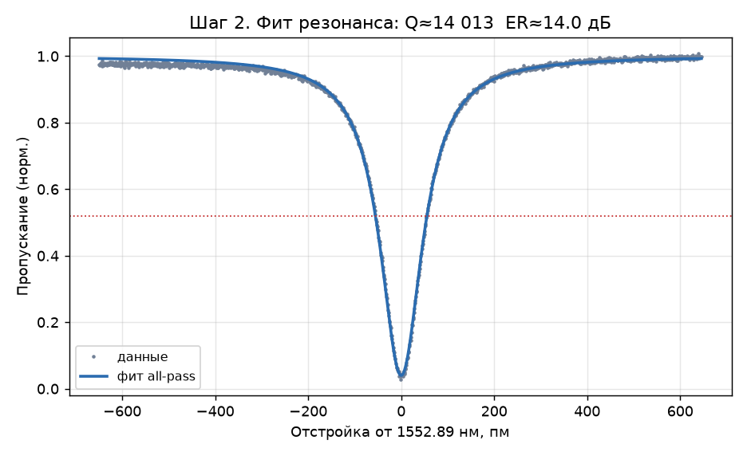
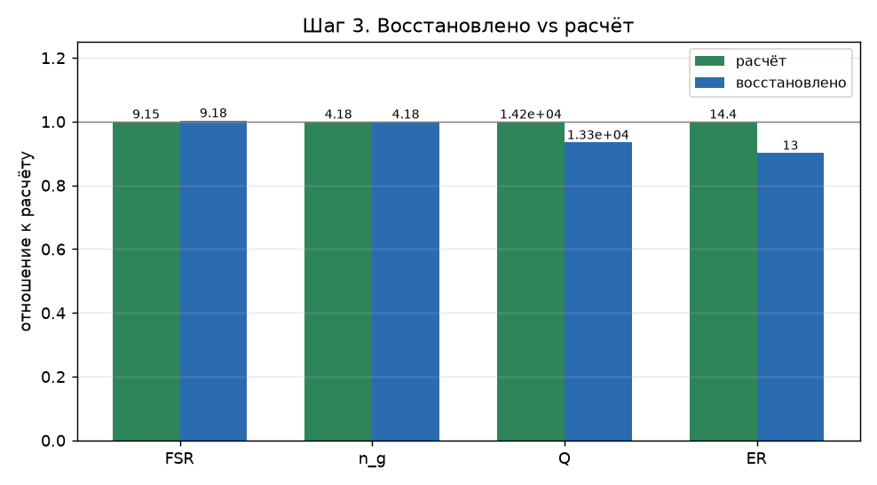
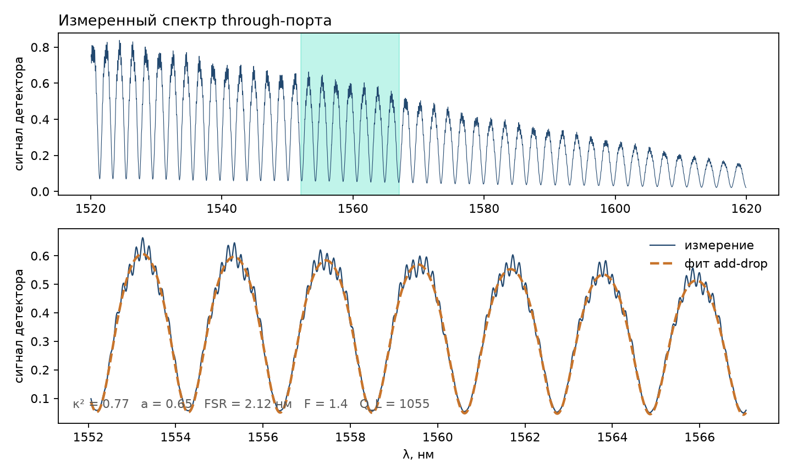

# Ring Resonator Spectrum Characterization

A small tool that recovers the **physical parameters of an all-pass microring resonator from its measured transmission spectrum** — the kind of trace you get from a tunable-laser sweep into a photodetector — and compares the recovered values against the calculated ones.

It is the experimental counterpart to the [`ring-resonator-tutorial`](https://github.com/baburinalex/ring-resonator-tutorial) project: that one goes *geometry → spectrum*, this one goes *measured spectrum → physical parameters*.



## What it does

To have something to process, the script first **synthesizes a realistic measurement** — the ideal all-pass lineshape plus a Fabry–Pérot baseline ripple and detector noise — and saves it to `measured_spectrum.csv`. It then characterizes that trace as if the true values were unknown:

1. **Detrend** the baseline with an upper-envelope percentile filter.
2. **Detect** resonances (`scipy.signal.find_peaks`).
3. **Fit** each resonance to the all-pass transmission lineshape (`scipy.optimize.curve_fit`) → self-coupling `t`, round-trip amplitude `A`, resonance wavelength.
4. **Derive** the figures of merit: FSR (resonance spacing), loaded Q (via finesse), extinction ratio ER, group index `n_g` (from FSR and the known radius), propagation loss `α`, coupling `κ`.
5. **Compare** recovered vs calculated in a table and plots.




Typical recovery on the synthetic data: FSR and `n_g` within ~0.5%, `t`/`A` within ~0.2%, and the noise-sensitive Q/ER within ~10%.

## The `t ↔ A` degeneracy (important)

The transmission **magnitude** lineshape is symmetric under swapping the self-coupling `t` and the round-trip amplitude `A`. A fit to `|T|` alone therefore recovers the *unordered pair* `{t, A}` but **cannot** distinguish an undercoupled device from an overcoupled one. Resolving it requires extra information — the phase response, or a sweep over coupling strength. The tool reports this explicitly instead of silently guessing, and assigns the regime from design intent only for the final comparison.

## Quick start

```bash
python3 -m venv .venv
source .venv/bin/activate          # Windows: .venv\Scripts\Activate.ps1
pip install -r requirements.txt
python spectrum_fit.py
```

This prints the comparison table and writes three figures into `images/`.

## Using your own data

Replace `measured_spectrum.csv` with your measurement — two columns, `wavelength_nm, transmission` — and call:

```python
from spectrum_fit import characterize
import numpy as np

data = np.loadtxt("measured_spectrum.csv", delimiter=",", skiprows=1)
lam, T = data[:, 0], data[:, 1]
result = characterize(lam, T)
print(result["FSR"], result["Q"], result["ER"], result["n_g"])
```

The known device radius is set near the top of `spectrum_fit.py` (`R_KNOWN`) and is used to convert the measured FSR into a group index.

## Add-drop (drop-through) rings from a laser sweep

`spectrum_fit.py` above works on a synthetic **all-pass** trace and fits resonances
one at a time. `adddrop_fit.py` is the companion for **add-drop spectra as they come
off a tunable laser** — hundreds of thousands of points, detector volts, no
normalisation — where the through port is recorded and the finesse may be too low
for a single resonance to be a Lorentzian.

`make_example_sweep.py` produces the example trace, with the artefacts that make real
processing different from processing an ideal curve: a grating/facet envelope, two
incommensurate Fabry–Pérot cavities in the setup with drifting phase, detector noise
and dark level, stray light bypassing the ring, and a coupling coefficient that rises
with wavelength as a real directional coupler's does.

```bash
python make_example_sweep.py                 # writes data/ring_through_example.csv
python adddrop_fit.py --dark 0.006
python adddrop_fit.py my_sweep.csv --sep ';' --dark 0.0 --width 15
```

It bins the sweep onto a uniform grid, estimates `n_g·L` from the Fourier transform
of the frequency-resampled trace, then fits **whole windows of several periods** to
the symmetric add-drop through-port lineshape

```
T = env(λ) · (t² − 2t²a·cosφ + t²a²) / (1 − 2t²a·cosφ + t⁴a²) + offset,   φ = 2π·n_g·L/λ
```

and reports `κ² = 1 − t²`, `a`, `n_g·L`, FSR, finesse, `Q_L`, `Q_i` and the
round-trip loss per window. Fitting windows rather than single dips is what makes
the low-finesse case tractable; scanning several windows across the sweep is also
the cheapest honesty check — `a` that jumps from window to window means the fit is
not constraining it.



### When Q_i cannot be extracted

The `t ↔ A` degeneracy of the all-pass case has an analogue here, and the practical
limit is sharper: in the **overcoupled** regime the round-trip amplitude `a` is
carried almost entirely by the residual depth of the transmission minimum. At
κ² ≈ 0.8, devices with `a` = 0.80 and 0.90 differ by about 1 % of full scale — below
the stray light and Fabry–Pérot ripple of a typical setup, which fill the minima and
bias `a` downwards.

The generator makes this checkable, because the truth is printed. Same ring, same
2 dB of round-trip loss, only the coupler changed:

| | truth | recovered |
|---|---|---|
| κ² = 0.80 (`--kappa2 0.80`) | a = 0.794, 2.0 dB | a ≈ 0.64, **3.8 dB** — off by 2× |
| κ² = 0.02 (`--kappa2 0.02 --loss 0.2`) | a = 0.977, 0.2 dB | a ≈ 0.976, **0.21 dB** |

```bash
python make_example_sweep.py --kappa2 0.02 --loss 0.2 --out data/weak.csv
python adddrop_fit.py data/weak.csv --dark 0.006 --width 6 --smooth 3
```

`adddrop_fit.py` prints a warning whenever κ² is large or `a` scatters across
windows; in that regime `Q_L` and `κ²` are the real results and `Q_i`, propagation
loss and any "intrinsic" number are not.

A ring intended to *measure loss* wants κ² of order 1–3 %, i.e. finesse 100–300 and
resonances 10–30 pm wide. Three habits that pay off: record the detector dark level
and pass it as `--dark` (otherwise it trades off against `a`), keep `--smooth` well
below the resonance width (at finesse 100+ that means single picometres, not the
60 pm default), and put a set of gaps on the mask so critical coupling can be
bracketed rather than assumed.

## Predicting the coupling from geometry

`coupler_supermodes.py` closes the loop: a scalar finite-difference solve of the
two-waveguide cross-section gives the even/odd supermode split `Δn`, hence the
transfer length and the coupling of a directional coupler.

```bash
python coupler_supermodes.py                      # table over gaps
python coupler_supermodes.py --gap 1.0 --target 0.02
```

```
L_π = λ / (2Δn)        κ² = sin²(π·Δn·L_eff/λ)
```

Comparing this against the κ²(λ) recovered from the sweep is a genuine test of the
whole chain: a measurement only fixes the product `Δn·L_eff`, so agreement means the
cross-section, the gap and the effective coupling length are all as drawn. The scalar
approximation understates `Δn` for high-contrast waveguides by a few per cent — use a
vectorial solver for final numbers.

## Repository layout

```
ring-resonator-measurement/
├── README.md
├── LICENSE
├── requirements.txt
├── spectrum_fit.py          # all-pass pipeline on a synthetic trace
├── adddrop_fit.py           # add-drop through-port pipeline for a laser sweep
├── make_example_sweep.py    # synthesizes the example sweep with realistic artefacts
├── coupler_supermodes.py    # kappa^2 from coupler geometry, for comparison
├── measured_spectrum.csv    # synthetic example measurement (all-pass)
├── data/
│   └── ring_through_example.csv   # generated example sweep, 1520-1620 nm, 1 pm steps
└── images/                  # figures produced by the scripts
```

## License

MIT — see [`LICENSE`](LICENSE).
